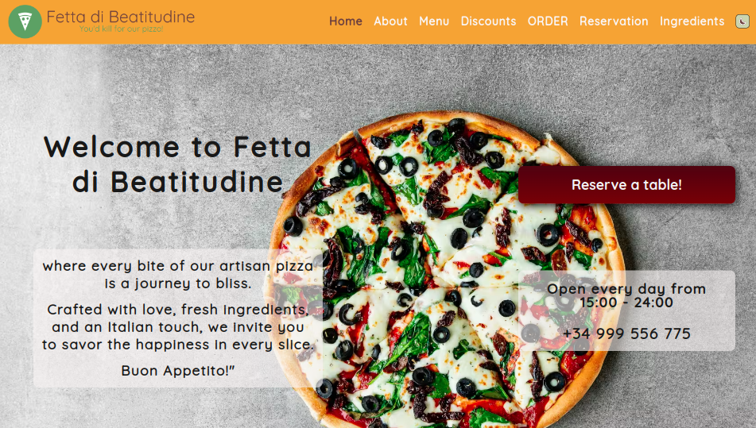

# Pizzeria Website Project
### Practice Project for the Pizzeria Website Design, Layout, Typography, and Content, all done in Figma.

## Description & Functionality
### Home Page
**Description**: The main landing page that provides an overview of the pizzeria.
**Content**:
- High-quality images of pizzas and the pizzeria.
- A welcome message or pizzeria motto.
- Links to key sections (Menu, Order Online, Specials, etc.).
- An embedded countdown timer to the next special event or promotion (e.g., Pizza Friday special deal).

### About Page
**Description**: A page detailing the history, mission, and values of the pizzeria.
**Content**:
- A brief history of the pizzeria.
- Information about the founder and key staff members.
- The pizzeria’s philosophy or mission statement.
- Awards and recognitions.

### Menu Page
**Description**: A page showcasing the pizzeria’s food and drink offerings.
**Content**:
- Categories (Pizzas, Appetizers, Salads, Desserts, Beverages, etc.).
- Detailed descriptions and images of each dish.
- Prices for each item.

### Discounts Page
**Description**: A page highlighting weekly discounts, promotions, and social media giveaways.
**Content**:
- Weekly discounts and promotions.
- Social media giveaways.

### Order Online Page
**Description**: A page where customers can place online orders for delivery or pickup.
**Content**:
- Online ordering form.
- Menu integration for easy selection.
- Information about delivery areas and times.
- Payment options and instructions.

### Reservations Page
**Description**: A page allowing customers to make reservations, such as for a table or a private event.
**Content**:
- Reservation form.

### Ingredients Page
**Description**: A page detailing the ingredients used in the pizzeria’s dishes.
**Content**:
- List of ingredients and their sources.
- Information about the pizzeria’s farm-to-table practices.

### Privacy Policy Page, Terms of Use Page, and Legal Notice Page
- Privacy Policy
- Terms of Use
- Legal Notice

## Screenshot
>Final Online Website Screenshot

## Online Link
[github Pages Link](https://tiborkopca.github.io/Fetta-di-Beatitudine-Slice-of-Bliss-/)

## Authors

- [@TiborKopca](https://github.com/TiborKopca)

